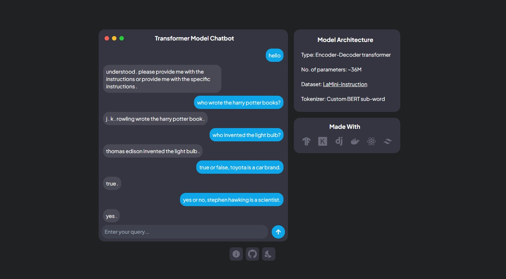

# chatbot-web
A full-stack web app to interact with the <a href="https://github.com/jensonjenkins/transformer-chatbot">transformer-chatbot</a> model.

## Technology
- Frontend: Typescript, React
- Backend: Django
- Model: TensorFlow, Keras
  
## Demo


## Installation (To run on a local machine)
1. Clone the repository: 
```bash
git clone https://github.com/jensonjenkins/chatbot-web
```
2. Navigate to the server directory and create the docker image:
```bash
cd server
```
```bash
docker compose up --build
```
3. Run the server inside the docker container:
```bash
docker exec -it {container-id} /bin/bash
```
```bash
python manage.py runserver 0.0.0.0:8000
```
4. Navigate to the client directory and run the client web app:
```bash
npm start
```


